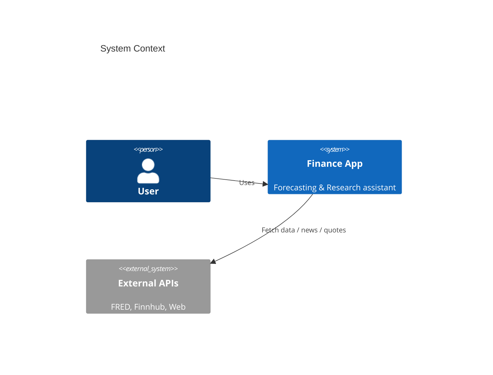
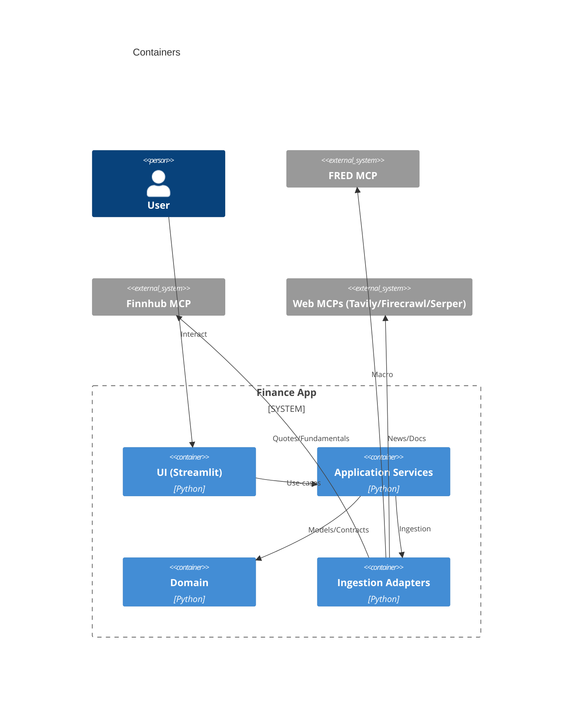
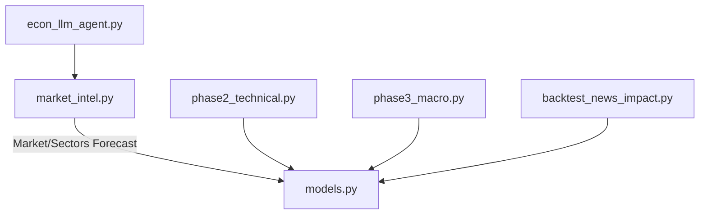

Architecture C4 (Mermaid)

Context

```mermaid
C4Context
title System Context
Person(user, "User")
System(app, "Finance App", "Forecasting & Research assistant")
System_Ext(apis, "External APIs", "FRED, Finnhub, Web")
Rel(user, app, "Uses")
Rel(app, apis, "Fetch data / news / quotes")
```

Containers

```mermaid
C4Container
title Containers
Person(user, "User")
System_Boundary(app, "Finance App"){
  Container(ui, "UI (Streamlit)", "Python")
  Container(appsvc, "Application Services", "Python")
  Container(domain, "Domain", "Python")
  Container(ing, "Ingestion Adapters", "Python")
}
System_Ext(fred, "FRED MCP")
System_Ext(finn, "Finnhub MCP")
System_Ext(web, "Web MCPs (Tavily/Firecrawl/Serper)")
Rel(user, ui, "Interact")
Rel(ui, appsvc, "Use-cases")
Rel(appsvc, domain, "Models/Contracts")
Rel(appsvc, ing, "Ingestion")
Rel(ing, fred, "Macro")
Rel(ing, finn, "Quotes/Fundamentals")
Rel(ing, web, "News/Docs")
```

Components (Application Services)

```mermaid
flowchart TB
  A[market_intel.py] -->|Market/Sectors Forecast| B[models.py]
  C[phase2_technical.py] --> B
  D[phase3_macro.py] --> B
  E[econ_llm_agent.py] --> A
  F[backtest_news_impact.py] --> B
```
