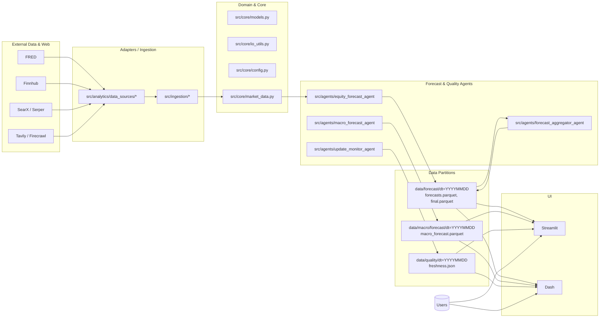

# Data Flow — Prévisions & UI

Objectif: illustrer le flux de données et responsabilités sans orchestrateur central (Makefile/cron + UI en lecture).

Notes
- Les agents écrivent des partitions immuables par date (idempotence par dt).
- L’UI lit la « dernière partition » par défaut mais peut sélectionner une date (US23).
- Pas d’orchestrateur: cibles Makefile/cron; UI ne déclenche pas de calculs réseau.
